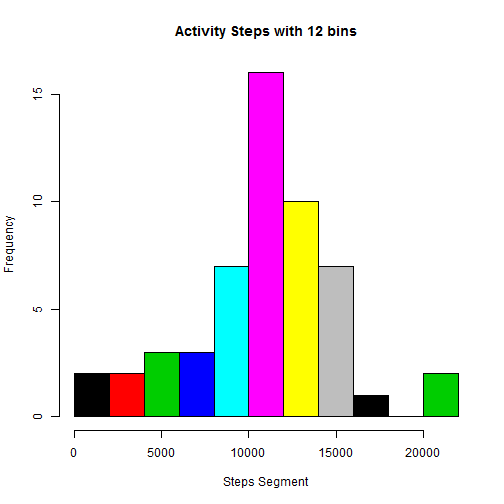
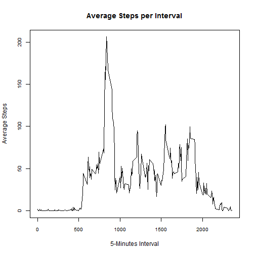
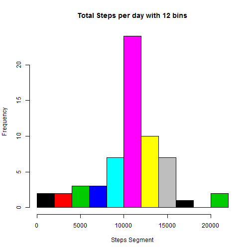
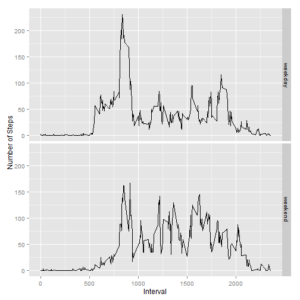

###Report of Activity Monitoring Device Analysis###
***
#####Author: Byron.Bian#####
***

####Question: What is mean total number of steps taken per day?

1 Calculate the steps aggregation and plot the histgram

```r
#Change System Locale
Sys.setlocale("LC_TIME","us")
```

```
## [1] "English_United States.1252"
```

```r
#Read Activity DataSet and Filter out those NA values
#DataSet file is saved at current working directory
setwd("E:\\DataScience")
Activity<-read.csv("./activity.csv")
Activity<-Activity[complete.cases(Activity),]

#Aggregate steps per day
Act<-aggregate(steps~date,data=Activity,sum)
#Plot the histogram
hist(Act$steps,
     breaks=12,
     col=c(1:12),
     xlab="Steps Segment",
     ylab="Frequency",
     main="Activity Steps with 12 bins"
     )
```

 

2 Calculate and Report the Mean and Median of the totoal number of steps taken per day
Mean of total number of steps per day is:

```r
meanval<-mean(Act$steps)
print(meanval)
```

```
## [1] 10766.19
```

Median of total number of steps per day is:

```r
medval<-median(Act$steps)
print(medval)
```

```
## [1] 10765
```

####Question: What is the average daily activity pattern
1 Make a time series, reflecting relationship between 5-minute interval and average steps

```r
Act2<-aggregate(steps~interval,data=Activity,mean)
with(Act2,plot(interval,steps,
               type="l",
               xlab="5-Minutes Interval",
               ylab="Average Steps",
               main="Average Steps per Interval",
               cex.axis=0.8))
```

 

2 Report which 5-Minute interval on average contains the maximum number of steps

```r
print(subset(Act2,steps==max(Act2$steps))$interval)
```

```
## [1] 835
```

####Question: Imputing missing values
1 Calculate and Report the total number of missing values in dataset

```r
#re-read dataset again
setwd("E:\\DataScience")
Activity<-read.csv("./activity.csv")
Act.Cmp<-Activity[complete.cases(Activity),]
Act.NA<-Activity[!complete.cases(Activity),]
print(dim(Act.NA)[1])
```

```
## [1] 2304
```

2 Devise a strategy for filling in all of the missing values in the dataset

3 Create a new dataset that is equal to the original dataset but with the missing data filled in

```r
#Using the mean of the given interval
Act.Mean<-aggregate(steps~interval,data=Act.Cmp,mean)
names(Act.Mean)[2]<-"steps.mean"
head(Act.Mean)
```

```
##   interval steps.mean
## 1        0  1.7169811
## 2        5  0.3396226
## 3       10  0.1320755
## 4       15  0.1509434
## 5       20  0.0754717
## 6       25  2.0943396
```

```r
Act.New<-merge(Act.NA,Act.Mean,by.x="interval",by.y="interval")
#Round the mean steps to an integer value
Act.New$steps<-round(Act.New$steps.mean)

#Combine two datasets and sort data by date & interval
Act.New<-rbind(Act.Cmp,Act.New[,c(2,3,1)])
Act.New<-with(Act.New,Act.New[order(date,interval),])
head(Act.New)
```

```
##        steps       date interval
## 152651     2 2012-10-01        0
## 152741     0 2012-10-01        5
## 152811     0 2012-10-01       10
## 152931     0 2012-10-01       15
## 152971     0 2012-10-01       20
## 153091     2 2012-10-01       25
```

4 Analysis on filled dataset   
4.1 Plot the histogram

```r
Act.Sum<-aggregate(steps~date,data=Act.New,sum)
hist(Act.Sum$steps,
     breaks=12,
     col=c(1:12),
     xlab="Steps Segment",
     ylab="Frequency",
     main="Total Steps per day with 12 bins"
     )
```

 

4.2 Calculate and report the mean and median total number of steps taken per day   
Mean of total number of steps   

```r
print(mean(Act.Sum$steps))
```

```
## [1] 10765.64
```

Median of total number of steps   

```r
print(median(Act.Sum$steps))
```

```
## [1] 10762
```

4.3 Do these values differ from the estimates from the first part of the assignment?   
A: By comparison of two histograms, values amost have no difference from the first part of estimates

4.4 What is the impact of imputing missing data on the estimates of the total daily number of steps?   
A: Imputing missing data on the estimates made the shape of total daily number of steps more centralized, that's to say
the frequency of median value now is more higher than first estimate.

####Question: Are there differences in activity patterns between weekdays and weekends?

1 Create a new factor variable in the dataset with two levels ¨C ¡°weekday¡± and ¡°weekend¡±

```r
Act.New$wkday<-weekdays(as.POSIXct(Act.New$date,"%Y-%m-%d",tz="UTC"),abbreviate=TRUE)
Act.wkend<-with(Act.New,Act.New[wkday %in% c("Sat","Sun"),])
Act.wkday<-with(Act.New,Act.New[!(wkday %in% c("Sat","Sun")),])
Act.wkend$wkday<-"weekend"
Act.wkday$wkday<-"weekday"
Act.New<-rbind(Act.wkday,Act.wkend)
Act.New$wkday<-as.factor(Act.New$wkday)
Act.New<-with(Act.New,Act.New[order(date,interval),])
head(Act.New)             
```

```
##        steps       date interval   wkday
## 152651     2 2012-10-01        0 weekday
## 152741     0 2012-10-01        5 weekday
## 152811     0 2012-10-01       10 weekday
## 152931     0 2012-10-01       15 weekday
## 152971     0 2012-10-01       20 weekday
## 153091     2 2012-10-01       25 weekday
```

2 Make a panel plot containing a time series plot of the 5-minute interval (x-axis) and the average number of steps taken, averaged across all weekday days or weekend days (y-axis).  

```r
library(ggplot2)
Act.New<-aggregate(steps~interval+wkday,data=Act.New,mean)
qplot(interval,steps,
      data=Act.New,
      geom="line",
      facets=wkday~.,
      xlab="Interval",
      ylab="Number of Steps",
      fill=wkday)
```

 

Conclusion: Distributions of activity patterns between weekday and weekend have a slight difference, average step numbers during weekday are more higher than are those of weekend

